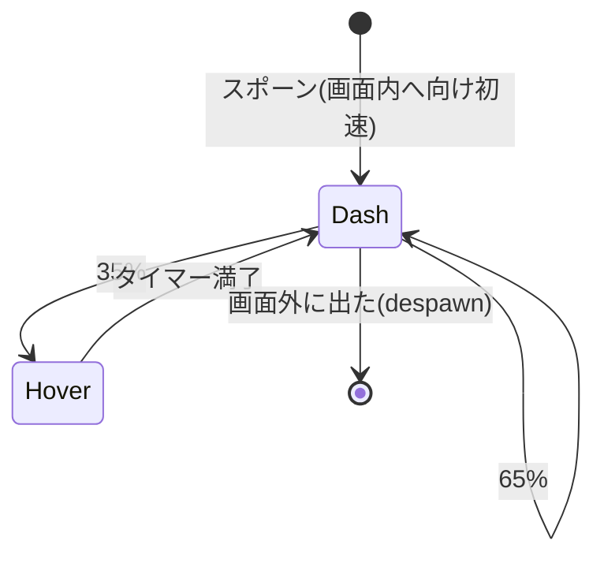
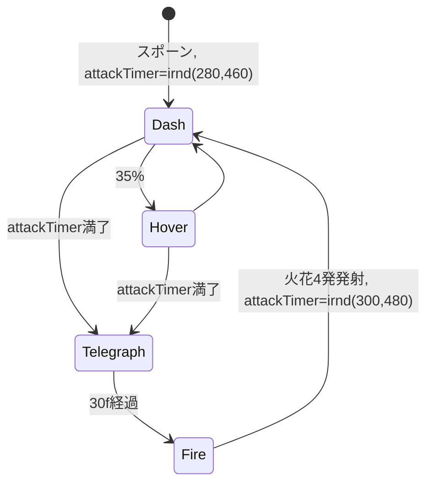
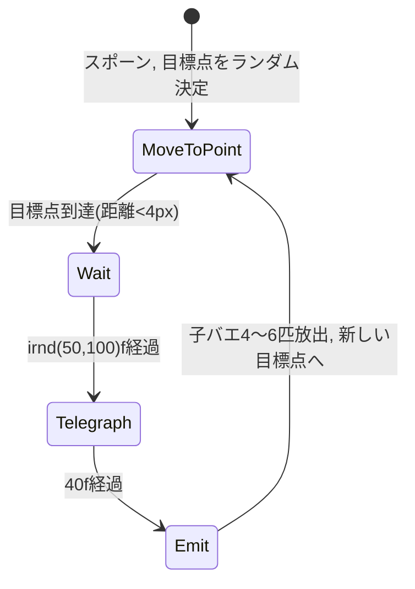
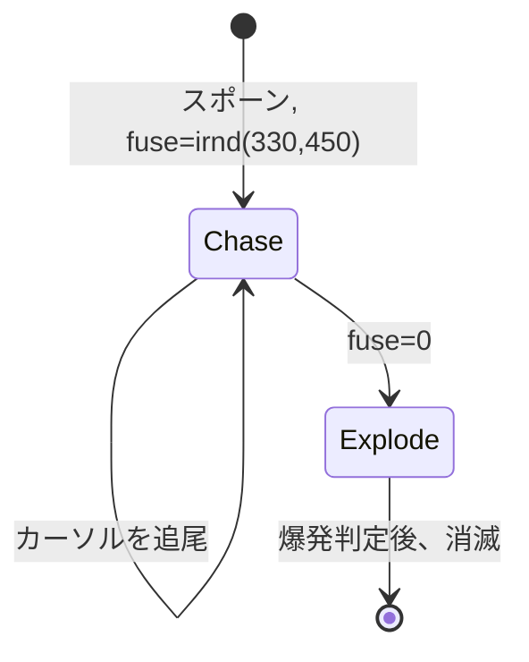

# ハエたたき 敵仕様書（実装用詳細版）

マリオペイント「ハエたたき」型ゲームの敵挙動を、別エンジン（Unity等）で再実装するための仕様書。
本リポジトリのWeb版クローン（`index.html`）で実証済みのパラメータを正とする。

各敵の「この動きがなぜ面白いか」も併記する。**動きの仕様と面白さの理由はセット**であり、
パラメータを変える際は「その動きが担う面白さ」を壊さないことを判断基準にする。

---

## 0. 前提（座標系と単位）

| 項目 | 値 |
|---|---|
| 基準フィールド | 幅 640 × 高さ 480（うち上部44はHUD帯。プレイ領域は 640×436） |
| 基準フレームレート | 60fps |
| 速度の単位 | px/frame（60fpsのとき）。**px/秒に直すには×60** |
| 時間の単位 | frame（60f = 1秒） |

Unityへの移植時は「フィールド幅を1とした比率」に正規化するのが安全。
例: 小型のハエのダッシュ速度 3.0〜4.4 px/f = フィールド幅の 0.28〜0.41 /秒。

乱数表記 `rnd(a, b)` は一様乱数。`irnd(a, b)` は整数一様乱数（両端含む）。

---

## 1. 共通仕様

### 1.1 プレイヤー（ハエたたき）

- カーソル位置 = **網の中心**。攻撃判定は網（半径約26px）
- カーソルの58px下 = **握り拳（急所）**。被弾判定は拳（半径15px）
- この「攻撃点と急所の位置がズレている」ことが重要仕様。
  追尾系の敵は**拳**を狙うため、「網で迎え撃つ／拳を引いて逃がす」という操作の妙が生まれる
- スイング: クリックで発動。**クールダウン16f（約0.27秒）**。この間は再スイング不可
  - 連打を無効化し、一振りごとに「狙い」の重みを乗せるための隙。削ると連打ゲーになり単調化する
- 被弾時: 残機-1、硬直55f（スイング不可）、無敵130f（点滅表示）
- 残機: 初期3、上限6

### 1.2 ダメージルール

- **ハエ本体に触れてもミスにならない**（原作準拠。最重要ルール）
- ミスになるのは敵の「攻撃」のみ: 火花（弾）、子バエの群れ、爆発
- これにより「敵に近づいて叩く」行為が常に安全に始められ、リスクは
  「攻撃を出させてしまった後」にだけ発生する。攻めの積極性を保証する設計

### 1.3 スポーンシステム

```
同時出現上限 maxOnScreen = min(2 + level, 7)
毎フレーム: 画面内の敵数 < maxOnScreen なら
    待機タイマーを減算し、0になったら1匹スポーン
    次の待機タイマー = irnd(18, 55) frame
```

- スポーン位置: 画面四辺のランダムな一辺の外側20px（上下辺は x=rnd(40, W-40)、左右辺は y=プレイ領域内ランダム）
- 「倒すと少し間を置いて次が湧く」テンポが原作の呼吸。待機タイマーを0にすると休む間がなくなり疲れる

### 1.4 敵構成比（レベル別出現テーブル）

| レベル | 小型 | 水色 | 黄色 | 爆弾 |
|---|---|---|---|---|
| 1 | 75% | 25% | - | - |
| 2 | 60% | 20% | 20% | - |
| 3以降 | 50% | 20% | 15% | 15% |

- レベル = 撃破数100匹ごとに+1（原作の「1面=100匹」のペース感）
- 段階的に敵種を解禁するのは学習曲線のため。同時に全種を出すと初見の優先順位判断が破綻する

### 1.5 難易度スケーリング

```
speedMult = min(1 + (level - 1) * 0.08, 1.6)   // 全敵・全弾の速度に乗算
maxOnScreen = min(2 + level, 7)
```

---

## 2. 小型のハエ（基本の的）

> **担う面白さ**: 「叩く快感」の純粋担当。高速移動と急停止のリズムが
> 「止まった一瞬を狙う」狩りの快感を作る。無害なので安心して追える。

### 2.1 ステートマシン



### 2.2 パラメータ

| 項目 | 値 |
|---|---|
| 体の半径（当たり判定） | 10 px（見た目9px。**小さい=当てにくい**が個性） |
| ダッシュ速度 | rnd(3.0, 4.4) × speedMult px/f |
| ダッシュ持続 | irnd(16, 38) f |
| ダッシュ方向 | 全方位ランダム。ただし画面端付近（端から70px以内）で外向きなら反転補正 |
| ホバリング持続 | irnd(12, 34) f |
| ホバリング中の動き | 毎フレーム ±0.7px のランダムジッタ（羽音で震える感じ） |
| Dash→Hover遷移確率 | ダッシュ満了時 35%（残り65%は新しい方向で再ダッシュ） |
| 画面外判定 | フィールド外に40px出たら消滅（スポーンで補充） |

### 2.3 実装擬似コード

```csharp
void UpdateFly() {
    modeTimer--;
    if (mode == Dash) {
        pos += velocity;
        if (modeTimer <= 0) {
            if (Random.value < 0.35f) { mode = Hover; modeTimer = Rand(12, 34); }
            else NewDash();
        }
    } else { // Hover
        pos += RandomInsideUnitCircle() * 0.7f;
        if (modeTimer <= 0) NewDash();
    }
    if (OutOfField(pos, margin: 40)) Despawn();
}

void NewDash() {
    mode = Dash;
    modeTimer = Rand(16, 38);
    float ang = Random.Range(0, 2 * PI);
    velocity = Dir(ang) * Rand(3.0f, 4.4f) * speedMult;
    // 端付近で外向きなら内向きに反転（一直線に場外へ消えすぎない）
    if (NearEdgeAndHeadingOut(pos, velocity)) velocity = FlipInward(velocity);
}
```

### 2.4 チューニング指針

- **ホバリングの頻度と長さが「叩けそう感」を決める**。Hover遷移確率を下げる/短くするほど
  イライラ系になり、上げるほどヌルくなる。35% / 12〜34f は「2〜3回振れば当たる」バランス
- ダッシュ速度を上げるより、ダッシュ持続を延ばす方が「速く感じる」（画面を横切る距離が伸びるため）

---

## 3. 水色のハエ（時間圧をかける敵）

> **担う面白さ**: 「早く仕留めないと反撃される」という時間のプレッシャー。
> 前兆（停止+点滅）を見てから間に合うかどうかの距離・タイミング判断を迫る。
> 動きは小型と同一なので、プレイヤーは「色」だけで脅威を識別する。

### 3.1 ステートマシン



### 3.2 パラメータ

| 項目 | 値 |
|---|---|
| 体の半径 | 15 px（小型より大きく当てやすい＝優先撃破を促す） |
| 移動 | **小型のハエと完全同一**（ダッシュ+ホバリング） |
| 画面端 | 反射して画面に留まる（小型と違い**逃げ得を許さない**。脅威は場に残り続ける） |
| 攻撃タイマー | 初回 irnd(280, 460) f、以後 irnd(300, 480) f |
| 前兆（Telegraph） | 30f。その場に停止し、体色を白と交互に点滅。±1pxの震え |
| 攻撃 | 斜め4方向（45°, 135°, 225°, 315°）に火花を同時発射 |

### 3.3 火花（弾）の仕様

| 項目 | 値 |
|---|---|
| 弾速 | 2.4 × speedMult px/f、直進 |
| 半径 | 6 px |
| 消滅 | 画面外に20px出たら |
| 相殺 | **不可**（網で消せない。避けるしかない） |

### 3.4 チューニング指針

- 前兆30fは「隣にいれば叩いて止められる、遠いと間に合わない」時間。
  長くすると常に止められて脅威が消え、短くすると理不尽になる
- 斜め4方向固定なのが重要。**上下左右は安全**という学習が成立し、
  発射を見てから「軸をずらす」という回避技術が育つ。ランダム方向にすると学習が壊れる
- 攻撃タイマー280〜460f（約5〜8秒）は「放置したら1回撃たれる」くらい。
  水色を優先するか小型で数を稼ぐかの選択が常に発生する長さ

---

## 4. 黄色のハエ（リスクリワードの教師）

> **担う面白さ**: 「止まっている=最大のチャンス、同時に危険の予兆」という
> リスクとリワードの一致。撃ち漏らすと叩けない子バエの群れに追われ、
> 攻める側から逃げる側へ**攻守が逆転**する。ゲームに緩急を作る中核。

### 4.1 ステートマシン



### 4.2 パラメータ

| 項目 | 値 |
|---|---|
| 体の半径 | 15 px |
| 目標点 | フィールド内ランダム（端から70px以上内側） |
| 移動速度 | 2.0 × speedMult px/f、目標点へ直進（等速。読みやすい素直な動き） |
| Wait（静止） | irnd(50, 100) f。±0.5pxのジッタのみ。**この間が絶好の攻撃チャンス** |
| Telegraph | 40f。体をオレンジに点滅、尾を白く点滅（「尾から出る」ことを予告） |
| Emit | 子バエを irnd(4, 6) 匹、自身の位置から放出。その後すぐ次の目標点へ移動開始 |

### 4.3 子バエ（群れ）の仕様 — 叩けない追尾体

| 項目 | 値 |
|---|---|
| 半径 | 5 px |
| 出現 | 親の位置から1匹ずつ、**9fおき**に順次起動（数珠つなぎの列になる） |
| 追尾対象 | **握り拳（カーソルの58px下）** |
| 速度 | 2.1 × speedMult px/f |
| 旋回性能 | 最大 0.055 rad/f（約3.2°/f）。**ここが命** |
| 寿命 | 330 + 起動順×9 f（約5.5秒）。残り60fで点滅し、その後消滅（ポン、と煙エフェクト） |
| 叩けるか | **不可**。網に触れても消えない |
| 被弾 | 拳に接触（距離 < 5+15px）で残機-1。当たった子バエは消える |

**旋回性能 0.055 rad/f の意味**:
子バエの速度と旋回半径の関係で、**直角に急旋回すると振り切れる**が、直線的に逃げると追いつかれる。
「逃げ方に技術がある」のはこの旋回制限のおかげ。旋回性能を上げると理不尽（絶対当たる）になり、
下げると無害（棒立ちでも当たらない）になる。速度2.1 / 旋回0.055 の比率を保つこと。

### 4.4 チューニング指針

- Wait 50〜100f は「気づいて移動すれば叩ける」長さ。ここを短くすると
  「止まる=チャンス」の構図が消え、ただの理不尽な砲台になる
- 子バエの寿命約5.5秒は「逃げ切りが成立するが、その間ずっと他のハエを叩けない」長さ。
  **時間コストがペナルティ**になっている（残機を失わなくても損をする）のが上手い設計
- 群れの数珠つなぎ（9f間隔起動）により、先頭を振り切っても後続が別角度から来る。
  1匹の追尾より「群れに囲まれる恐怖」が出る

---

## 5. 爆弾ハエ（距離のチキンレース）

> **担う面白さ**: 唯一「向こうから来る」敵。近いほど当てやすいが爆発リスクも増す、
> 距離のチキンレース。逃げ続けても自爆に巻き込まれる恐れがあるため、
> 「いつ踏み込んで叩くか」の勇気を要求する。

### 5.1 ステートマシン



### 5.2 パラメータ

| 項目 | 値 |
|---|---|
| 体の半径 | 15 px |
| 追尾対象 | **カーソル（網の位置）**。子バエと違い拳ではなく網を狙う |
| 速度 | 1.7 × speedMult px/f |
| 旋回性能 | 最大 0.045 rad/f（子バエよりさらに曲がれない=振り切りやすい） |
| 導火線（fuse） | irnd(330, 450) f（約5.5〜7.5秒） |
| 警告表示 | 残り90fから赤点滅（8f周期）、残り40fから高速点滅（4f周期） |
| 爆発 | fuse=0で自爆。**拳が半径62px以内**なら残機-1 |
| 叩けるか | **可**。爆発前に叩けば通常撃破（カウント+1） |

### 5.3 実装擬似コード

```csharp
void UpdateBomb() {
    // カーソルへ旋回制限付き追尾
    float want = AngleTo(pos, cursorPos);
    angle += Clamp(DeltaAngle(angle, want), -0.045f, 0.045f);
    pos += Dir(angle) * 1.7f * speedMult;

    fuse--;
    if (fuse <= 0) {
        SpawnExplosionFx(pos);
        if (Distance(pos, fistPos) < 62f) PlayerHurt();
        Despawn();
    }
}
```

### 5.4 チューニング指針

- 追尾速度1.7はプレイヤーのマウス速度より十分遅い。**逃げは常に成立する**。
  怖いのは「他のハエに気を取られている間に近づかれている」こと。
  マルチタスクの監視コストが本体
- カーソル（網）を狙うので、**迎え撃つと必ず網の正面に来る**=叩きやすい。
  「怖いが、正対すれば簡単に処理できる」という構図が踏み込む勇気に報いる
- 爆発半径62pxは網の判定(26px)より十分大きい。「爆発直前に叩く」ギャンブルは
  成立するが、点滅の見極めが要る

---

## 6. 1UPハンド（注意資源への報酬）

> **担う面白さ**: まれにしか出ず、点滅しながら飛び去る一瞬の報酬。
> 乱戦中でも画面全体へ注意を払わせ、「気づいて取れた」得した感覚を作る。

| 項目 | 値 |
|---|---|
| 出現間隔 | rnd(50, 95) × 60 f（約50〜95秒に1回） |
| 出現 | 左右どちらかの画面外から、水平に横切る |
| 速度 | 水平 1.2 px/f + 上下に sin波（振幅約±18px、角速度0.06 rad/f） |
| 表示 | **点滅**（10f周期で7f表示/3f非表示） |
| 取得 | 網でスイングして接触（半径16px）。残機+1（上限6） |
| 消滅 | 反対側の画面外へ出たら（取り逃し） |

- 画面を横切り切るまで約9秒。「気づけば余裕、気づかなければ消えている」長さ

---

## 7. レベル進行と全体テンポ

| 撃破数 | レベル | 変化 |
|---|---|---|
| 0〜99 | 1 | 小型+水色のみ。基本の「叩く」と「優先順位」を学ぶ |
| 100〜199 | 2 | 黄色が追加。「逃げる」局面が生まれる |
| 200〜299 | 3 | 爆弾が追加。全要素が揃う |
| 300〜 | 4+ | 構成は固定。速度+8%/レベル（上限+60%）、同時数+1（上限7） |

- レベルアップ時: 中央に「LEVEL n」表示（100f）+ ジングル。プレイは中断しない

---

## 8. 面白さの構造マップ（チューニングの北極星）

```
「叩く快感」        小型のハエ（急停止のリズム）+ スイングSE + スプラット表示
      ×
「選ぶ緊張感」      水色（時間圧）/ 黄色（止まったら優先）/ 爆弾（接近監視）
                    → 無害な的と脅威の混在が常時の優先順位判断を生む
      ×
「攻守の緩急」      子バエに追われる時間（攻め→逃げ→攻め）
                    → 旋回制限が「逃げの技術」を成立させる
      +
「一振りの重み」    スイングCD 16f（連打無効）
「注意の報酬」      1UPハンド（まれ・点滅・時限）
```

**パラメータ変更時のチェックリスト**:
1. その変更は上のどの要素に触るか？
2. 「ハエ本体は無害」を壊していないか？（攻めの積極性の根拠）
3. 前兆→攻撃の猶予は「近ければ止められる」を保っているか？
4. 追尾系の速度/旋回比は「技術で振り切れる」を保っているか？
5. 網と拳の位置ズレ（58px）を活かした攻防が残っているか？
